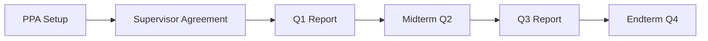

# React App Implementation Guide — MoH Uganda PMS (iHRIS)

## Project Overview

Build a production-quality React application for the **Ministry of Health Uganda Performance Management System (PMS - iHRIS)**. The system manages employee performance across the health sector hierarchy: Health Worker → Supervisor → Department Head → HR Manager.

The application must provide:

### Core Modules

| Module | Description |
|--------|-------------|
| **auth** | Role-based login (health_worker, supervisor, department_head, hr_manager, admin); JWT from Goravel API |
| **dashboard** | Role-specific dashboards inspired by wireframes (4 dashboard variants) |
| **profile** | Staff biodata, active contract, deployment, supervisor chain |
| **performance** | PPA (Planning & Performance Agreement), quarterly reporting (Q1, Midterm, Q3, Endterm), KPI weighting to 100% |
| **leave** | Leave requests with sequential supervisor approval (1–3 approvers) |
| **notifications** | Alerts for missed tasks, upcoming deadlines, approvals |
| **settings** | User preferences; server config loaded from `/api/v1/config` |

### Tech Stack (Required)

- React 19 + TypeScript
- Vite 8
- Atomic Design Architecture
- Zustand (client state)
- TanStack React Query (server state)
- Axios (HTTP)
- Zod (runtime validation)
- Tailwind CSS v4
- i18next + react-i18next
- Recharts (dashboard trends)
- Lucide React (icons)

---

## Architecture Goals

1. **Atomic Design** — atoms → molecules → organisms → templates → pages
2. **Feature-driven** — each module owns UI, hooks, and local types
3. **Scalable** — API adapters isolate backend contract changes
4. **Offline-capable** — React Query persistence + service worker (phase 2)
5. **Server-driven config** — branding, thresholds, roles from Goravel `/api/v1/config`

---

## Folder Structure

```text
src/
├── app/
│   ├── navigation/
│   ├── providers/          # QueryClient, Router, i18n
│   ├── routes/             # AppRoutes, protected routes
│   └── config/             # Runtime config loader
├── api/
│   ├── interfaces/
│   ├── adapters/           # Map API DTOs → domain models
│   ├── services/           # Axios service functions
│   ├── interceptors/       # Auth token, error handling
│   └── types/
├── assets/
│   ├── images/             # MoH logo, Coat of Arms (left placement)
│   └── icons/
├── components/
│   ├── atoms/              # Button, Text, Card, Input, Avatar, Badge, Loader
│   ├── molecules/          # ProgressBar, SummaryCard, FormField, StatusDot
│   ├── organisms/          # DataTable, DashboardHeader, NotificationList
│   └── templates/          # DashboardLayout, AuthLayout
├── modules/
│   ├── auth/
│   ├── dashboard/          # HealthWorker, Supervisor, DeptHead, HRManager
│   ├── profile/
│   ├── performance/        # PPA wizard, quarterly reports
│   ├── leave/
│   ├── notifications/
│   └── settings/
├── hooks/
├── stores/                 # Zustand: auth, ui, offline queue
├── localization/           # en.json, future lg.json
├── theme/                  # MoH color tokens
├── types/
├── utils/
└── constants/
```

---

## Design System — MoH Uganda Branding

### Colors

```ts
export const colors = {
  primary: '#2E7D32',      // MoH Green
  lightGreen: '#66BB6A',
  accent: '#F9A825',       // Gold
  success: '#4CAF50',
  warning: '#FF9800',
  error: '#D32F2F',
  background: '#F8FAF5',
  card: '#FFFFFF',
  national: {
    black: '#000000',
    yellow: '#FCDC04',
    red: '#D90000',
  },
}
```

### Typography

- Primary font: **Arial, Helvetica, sans-serif** (MoH standard)
- Headings: bold, MoH green
- Body: 14–16px, high contrast for accessibility

### Co-branding Rules

1. MoH Uganda logo or Coat of Arms — **top left**, prominent
2. Partner logos (Africa CDC, ASLM, WHO) — same row, MoH takes precedence
3. Implementing partners — single bottom row, equal visual weight
4. Tagline: **Saving Lives Livelihoods**

### Status Indicators (from wireframes)

| Status | Color | Threshold |
|--------|-------|-------------|
| On Track | Green `#4CAF50` | ≥80% tasks, attendance ≥95% |
| At Risk | Gold/Orange `#FF9800` | <60% tasks |
| Off Track | Red `#D32F2F` | >2 missed tasks |

---

## Dashboard Wireframe Mapping

### 1. Health Worker Dashboard

**API:** `GET /api/v1/dashboard/health-worker?staff_id=&quarter=`

| Wireframe Section | Component |
|-------------------|-----------|
| Header (name, role, quarter) | `DashboardHeader` organism |
| Task completion bar | `ProgressBar` molecule |
| Tasks due this week | `TaskChecklist` organism |
| Upcoming deadlines | `DeadlineList` organism |
| Quarterly task breakdown | `DataTable` organism |
| Attendance summary Q1 | `AttendanceTable` organism |
| Notifications & alerts | `NotificationList` organism |

### 2. Supervisor Dashboard

**API:** `GET /api/v1/dashboard/supervisor?team=&quarter=`

- Team task completion progress bar
- Summary cards: Total Staff, On Track, At Risk, Off Track
- Pending approvals table (Leave, OOS, Appraisal) with Approve/Reject actions
- Team member task completion table with status dots
- Staff requiring PIP table with Initiate PIP action
- Attendance summary team table
- Export: Excel, PDF, Print

### 3. Department Head Dashboard

**API:** `GET /api/v1/dashboard/department-head?department=&quarter=`

- Department task completion (teams on track)
- Summary cards: Total Teams, Total Staff, On/At Risk/Off Track
- Team performance summary table
- Teams requiring leadership intervention (PIP)
- Department trends bar chart (Recharts)
- Export: Excel, PDF, PPT, Print

### 4. HR Manager Dashboard

**API:** `GET /api/v1/dashboard/hr-manager?sector=&quarter=`

- Sector task completion
- Institution performance summary
- Institutions requiring HR intervention
- PIP analytics (by level bar chart)
- Sector trends (4 quarters)
- Export + Send to (Permanent Secretary, Global Fund, PPDA)

---

## API Integration

### Base URL

```env
VITE_API_BASE_URL=http://localhost:3000/api/v1
```

### Config Bootstrap (run on app load)

```ts
// src/app/config/loadAppConfig.ts
import { configService } from '@/api/services/pms'
import { z } from 'zod'

const ConfigSchema = z.object({
  name: z.string(),
  acronym: z.string(),
  branding: z.record(z.any()),
  performance: z.record(z.any()),
  roles: z.array(z.string()),
})

export async function loadAppConfig() {
  const data = await configService.getPublicConfig()
  return ConfigSchema.parse(data)
}
```

### React Query Pattern

```ts
export function useHealthWorkerDashboard(staffId: number, quarter: string) {
  return useQuery({
    queryKey: ['dashboard', 'health-worker', staffId, quarter],
    queryFn: () => dashboardService.healthWorker(staffId, quarter),
    staleTime: 5 * 60 * 1000, // matches Redis cache TTL server-side
  })
}
```

### Zod Validation Example (PPA KPI weights)

```ts
import { z } from 'zod'

export const PpaKpiSchema = z.object({
  kpi_id: z.number(),
  weight_percentage: z.number().min(0).max(100),
  target_value: z.number().optional(),
})

export const PpaFormSchema = z.object({
  kpis: z.array(PpaKpiSchema).refine(
    (kpis) => kpis.reduce((sum, k) => sum + k.weight_percentage, 0) === 100,
    { message: 'KPI weights must total 100%' },
  ),
})
```

---

## Performance Module (PPA + Quarterly Reporting)

### Workflow



### PPA Rules

1. Employee and supervisor select KPIs from assignment matrix
2. Each selected KPI gets a **weight %** — total must equal **100%**
3. Targets set per KPI during PPA
4. Status flow: `draft` → `pending_approval` → `approved`

### Quarterly Reporting

| Phase | Report Type | API (future) |
|-------|-------------|--------------|
| Q1 | `q1` | `POST /api/v1/performance/reports` |
| Midterm | `midterm` | same |
| Q3 | `q3` | same |
| Endterm | `endterm` | same |

Each report captures `actual_value`, `narrative`, `evidence_url` per PPA KPI.

---

## Leave Management Module

### Flow

1. Employee submits leave request
2. Routed to supervisors by `approval_sequence` (1, 2, 3)
3. Each supervisor approves/rejects in order
4. HR approval for study leave (config-driven)

### Leave Types (from server config)

- Annual, Sick, Study, Maternity, Paternity

### UI Components

- `LeaveRequestForm` — date range, type, reason
- `LeaveApprovalQueue` — supervisor pending list
- `LeaveCalendar` — team availability view

---

## Zustand Stores

### Auth Store

```ts
interface AuthState {
  role: UserRole
  staffId: number | null
  displayName: string
  quarter: string
  token: string | null
  setRole: (role: UserRole) => void
  logout: () => void
}
```

### UI Store

```ts
interface UiState {
  sidebarOpen: boolean
  activeModule: string
  toggleSidebar: () => void
}
```

---

## i18n Keys (starter)

```json
{
  "appName": "Performance Management System",
  "savingLives": "Saving Lives Livelihoods",
  "dashboard": {
    "taskCompletion": "Task Completion",
    "onTrack": "On Track",
    "atRisk": "At Risk",
    "offTrack": "Off Track"
  },
  "performance": {
    "ppa": "Planning & Performance Agreement",
    "q1": "Quarter 1 Reporting",
    "midterm": "Midterm Reporting",
    "q3": "Quarter 3 Reporting",
    "endterm": "Endterm Reporting"
  },
  "leave": {
    "apply": "Apply for Leave",
    "pending": "Pending Approval"
  }
}
```

---

## Implementation Phases

### Phase 1 — Foundation (Current)

- [x] Project scaffold (Vite, Tailwind, atomic folders)
- [x] Server config endpoint consumption
- [x] 4 role-based dashboard shells
- [x] MoH theme tokens
- [x] Docker + Redis + MySQL

### Phase 2 — Auth & Profile

- [ ] JWT login via Goravel auth
- [ ] Staff profile with biodata + active contract
- [ ] Supervisor chain display

### Phase 3 — Performance

- [ ] PPA wizard with 100% weight validation
- [ ] KPI assignment matrix viewer
- [ ] Quarterly report forms

### Phase 4 — Leave & Approvals

- [ ] Leave request CRUD
- [ ] Sequential approval workflow
- [ ] Supervisor approval queue integration

### Phase 5 — Offline & Export

- [ ] React Query persist + IndexedDB
- [ ] PDF/Excel export (server-generated)
- [ ] PWA service worker

---

## Cursor / AI Agent Prompt

Use this prompt when continuing development:

```text
You are building the MoH Uganda Performance Management System React frontend.

Stack: React 19, TypeScript, Vite, Tailwind v4, Zustand, TanStack Query, Axios, Zod, i18next, Atomic Design.

API base: VITE_API_BASE_URL (Goravel v1.18 backend).

Follow MoH branding: primary #2E7D32, accent #F9A825, background #F8FAF5, Arial/Helvetica.
Load public config from GET /api/v1/config before rendering themed UI.

Implement [MODULE_NAME] following the folder structure in docs/REACT_IMPLEMENTATION_GUIDE.md.
Match wireframe sections to organisms. Validate forms with Zod.
Use React Query for all API calls. Cache dashboard data for 5 minutes.
Support roles: health_worker, supervisor, department_head, hr_manager.

Reference wireframes for:
- Health worker: task completion, quarterly tasks, attendance, notifications
- Supervisor: team summary, pending approvals, PIP candidates
- Department head: team performance, trends chart, intervention table
- HR manager: institution summary, PIP analytics, sector trends
```

---

## Testing Checklist

- [ ] Config loads and applies MoH colors
- [ ] Role switcher renders correct dashboard
- [ ] Dashboard API errors show retry UI
- [ ] PPA form rejects weights ≠ 100%
- [ ] Leave approval respects sequence order
- [ ] Responsive layout on tablet (768px+)
- [ ] WCAG AA contrast on status badges

---

## Related Backend Docs

- Goravel API: `backend/routes/api.go`
- Database schema: `backend/database/migrations/20260707000001_create_pms_schema.go`
- iHRIS sync: `POST /api/v1/ihris/sync`
- Server config: `backend/config/pms.go`
