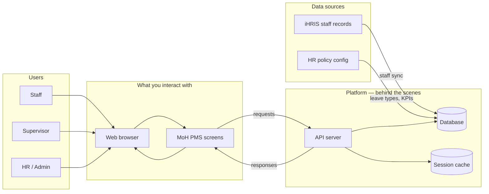
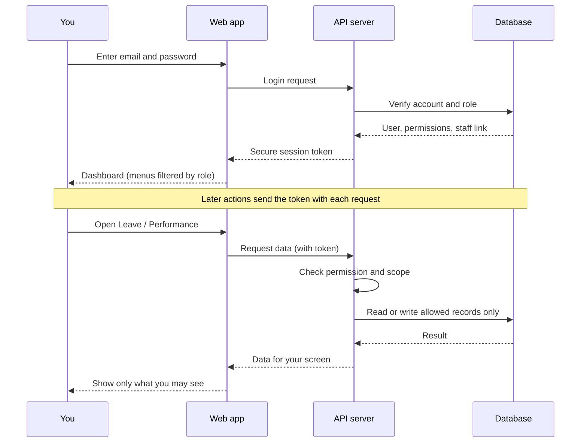
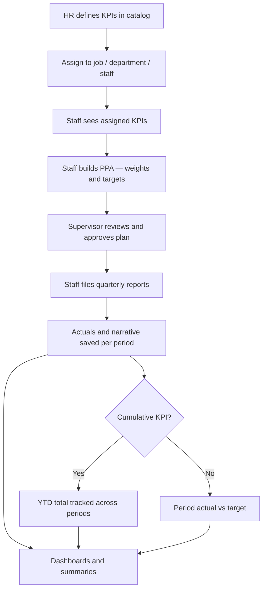
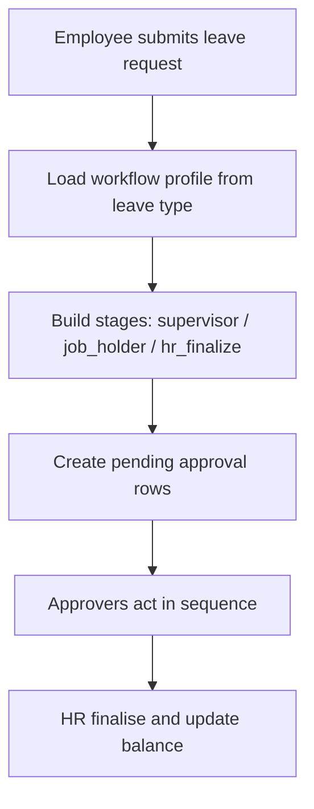
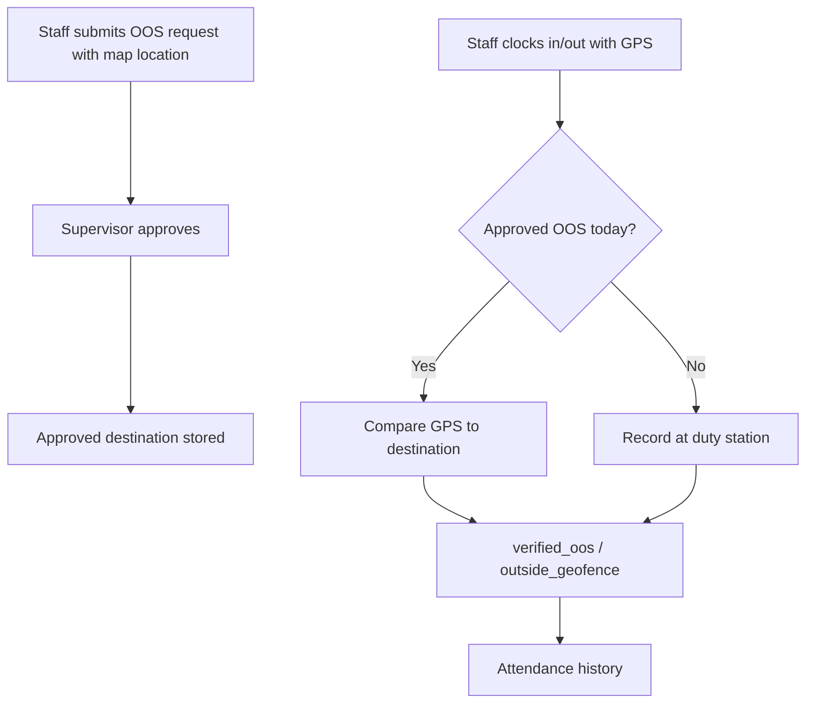

# MoH Performance Management System — User Guide

This guide explains how to use the web application for day-to-day performance management, leave, attendance, and administration at the Ministry of Health Uganda.

## Contents

1. [Getting started](#1-getting-started)
2. [System architecture and data flow](#2-system-architecture-and-data-flow)
3. [Navigation and roles](#3-navigation-and-roles)
4. [Dashboard](#4-dashboard)
5. [Performance management](#5-performance-management)
6. [Performance reports and scores](#6-performance-reports-and-scores)
7. [Leave](#7-leave)
8. [Out of station](#8-out-of-station)
9. [Attendance](#9-attendance)
10. [Notifications](#10-notifications)
11. [Profile and settings](#11-profile-and-settings)
12. [Administration (HR and system admins)](#12-administration-hr-and-system-admins)
13. [Troubleshooting](#13-troubleshooting)
14. [Accessing a deployed server](#14-accessing-a-deployed-server)

---

## 1. Getting started

### Sign in

1. Open the application URL provided by your IT team:
   - **Deployed server:** `http://<server-ip>/` (or your organisation domain)
   - **Local development:** `http://localhost:5173`
2. Enter your **email** and **password**.
3. Click **Sign in**.

Your session stays active until you sign out or the token expires. If you forget your password, contact your HR or system administrator.

### Demo environment

For training and demos, these accounts are available after database seeding:

| Email | Role |
|-------|------|
| `worker@moh.go.ug` | Health worker (staff) |
| `supervisor@moh.go.ug` | Supervisor |
| `depthead@moh.go.ug` | Department head |
| `hr@moh.go.ug` | HR officer |
| `director@moh.go.ug` | Director |
| `ps@moh.go.ug` | Permanent secretary |
| `admin@moh.go.ug` | System administrator |

Default demo password: **`Demo@Moh2026!`**

---

## 2. System architecture and data flow

This section gives a simple picture of how the system is built and how your actions move through it. You do not need technical knowledge to use PMS — this is here to help staff, supervisors, and HR understand **where information comes from** and **who sees what**.

### 2.1 Big picture — layers

When you use PMS in a browser, your request passes through a few layers before data is saved or returned:

```text
┌─────────────┐     ┌─────────────┐     ┌─────────────┐     ┌─────────────┐
│  You        │     │  Web app    │     │  API        │     │  Database   │
│  (browser)  │ ──► │  (screens)  │ ──► │  (server)   │ ──► │  (records)  │
└─────────────┘     └─────────────┘     └─────────────┘     └─────────────┘
      │                    │                    │                    │
  Click, type          Dashboard,           Rules, roles,        Staff, leave,
  sign in              Leave,               approvals,           KPIs, reports
                       Performance          permissions          attendance
```

| Layer | What it does | What you see |
|-------|----------------|--------------|
| **Browser** | Your phone or computer | Login page, menus, forms, charts |
| **Web app** | Screens and navigation | Dashboard, Performance, Leave, etc. |
| **API (server)** | Business rules and security | Nothing directly — works behind the scenes |
| **Database** | Permanent storage | Your saved requests, balances, reports |

On a deployed server, a **gateway (nginx)** sits in front and sends `/` to the web app and `/api/` to the server — so you use one address (e.g. `http://203.0.113.50/`) for everything.



### 2.2 Where master data comes from

| Data | Source | Who maintains it |
|------|--------|------------------|
| Staff names, jobs, facilities | **iHRIS** (synced into PMS) | National HR / iHRIS |
| User login and roles | **PMS accounts** | System administrators |
| Supervisors (up to 3 per staff) | **Staff management** | HR officers |
| KPI catalog and assignments | **KPI management** | HR / performance admins |
| Leave types, entitlements, stages | **Leave configuration** | HR officers |
| Your leave requests, PPAs, reports | **You and your approvers** | Created in PMS as you work |

PMS does **not** replace iHRIS for core HR master data — it **reads** staff deployment information and adds performance, leave workflow, and attendance on top.

### 2.3 Sign-in and access control

Every action is tied to your **account**, **role**, and **scope** (e.g. own records only, supervised staff, or whole district).



**Takeaway:** You only see menus and records your role allows. A health worker cannot open HR-wide leave administration; an HR officer can see org-wide balances but still follows permission rules.

### 2.4 Performance data flow (PPA and reporting)



| Step | Data created | Stored as |
|------|----------------|-----------|
| HR sets KPIs | Indicator definitions | KPI catalog |
| Assignment | Who must report which KPI | KPI assignments |
| PPA planning | Weights % and annual targets | Performance plan (PPA) |
| Quarterly report | Actual value + evidence text | Report entries per period |
| Cumulative KPI | Running year-to-date total | Each period stores latest YTD |

### 2.5 Leave and approval data flow

Leave requests use **configurable workflow profiles** — not a fixed supervisor count.



| Stage | What happens to data |
|-------|----------------------|
| Submit | Request saved; days calculated; balance checked against policy |
| Supervisor / job holder | Approval status, stage name, and comments updated per workflow stage |
| HR finalize | Request marked complete; **used days** added to balance |
| Notifications | You and approvers get in-app alerts |

Leave rules (types, entitlements by salary grade, advance notice, **workflow profiles and stages**) come from **HR configuration** in the database — not hardcoded — so policy and routing changes apply to new requests automatically.

See [leave.md](../leave.md) for the full workflow configuration guide.

### 2.6 Out of station and attendance



Attendance clock data links to **approved out-of-station** records so the system can verify you were at the declared location (within the configured distance).

### 2.7 End-to-end summary

```text
 iHRIS ──sync──► Staff directory ──► Your account linked to staff record
                                      │
 HR config ──► KPIs, leave policy ─────┤
                                      ▼
                              You use the web app
                                      │
                    ┌─────────────────┼─────────────────┐
                    ▼                 ▼                 ▼
              Performance          Leave          Attendance
              (PPA, reports)    (requests)      (clock, OOS)
                    │                 │                 │
                    └─────────────────┼─────────────────┘
                                      ▼
                              Database (single source
                              of truth inside PMS)
                                      │
                                      ▼
                    Dashboards, notifications, HR admin views
```

**In short:** iHRIS and HR configuration **feed in** master data; you and your approvers **create** transactional data (plans, reports, leave, attendance); the API **enforces** rules and permissions; everyone with the right role **sees** aggregated views on dashboards and admin screens.

---

## 3. Navigation and roles

The sidebar shows only the sections your account is allowed to access. Menu groups include:

| Group | Items | Who typically sees it |
|-------|-------|------------------------|
| **Dashboard** | Overview | All roles with dashboard permission |
| **Performance** | PPA, quarterly reporting, **Performance reports** | Staff with `performance.view` |
| **Time & Attendance** | Leave, Out of station, Attendance | Staff and supervisors |
| **Notifications** | Alerts and updates | Everyone |
| **My Account** | Profile, Settings | Everyone |
| **Administration** | Leave, Staff, KPI, Access control | HR officers and admins |

### What each role does

| Role | Primary responsibilities in PMS |
|------|--------------------------------|
| **Staff** | Build PPA, file quarterly reports, request leave/OOS, clock attendance |
| **Supervisor** | Approve leave/OOS, review team performance, supervision dashboard |
| **Department head** | Department-level oversight and dashboard |
| **HR officer** | Leave administration, staff records, org-wide reporting |
| **Director / Executive** | District or national dashboards and summaries |
| **Administrator** | KPI catalog, user access, system configuration |

---

## 4. Dashboard

After sign-in you land on **Dashboard**. The view adapts to your role:

- **Health worker** — personal KPIs, **overall performance score**, leave balance snapshot, attendance summary, quick links
- **Supervisor** — team leave/performance pending items, supervision metrics
- **Department head** — department coverage and performance indicators
- **HR / Director / Executive** — facility and district charts, org-wide KPI and attendance trends

### Interactive cards and drilldown tables

On HR and other management dashboards, **metric cards** and the **progress bar** are clickable. Selecting a card scrolls to a **drilldown table** below the charts with filtered data (e.g. facilities on track, at risk, or off track; district coverage; staff by facility).

- The active card is highlighted with a green ring.
- Use **Close** on the drilldown panel to return to the default view.

### Uganda district map (HR / national dashboards)

When district coverage data is available, a **choropleth map** of Uganda shows PMS activity by district boundary (not just map pins).

| Control | Purpose |
|---------|---------|
| **Metric** dropdown | Colour districts by staff on PMS, combined attendance, OOS GPS compliance, or HRM duty summary |
| **Show district names** | Toggle labels on the map |
| **Click a district** | Open a drilldown table with that district’s detail (ISO code, region, staff, rates) |

Districts without PMS staff appear pale green. Districts are matched to map boundaries using **ISO / map keys** stored in the districts reference table.

### Overall performance score (health worker dashboard)

Staff dashboards show an **Overall performance** card when quarterly report data exists. It displays:

- **Normalised score** (0–100%) — primary figure
- **Raw weighted average** — before normalisation
- **PPA status** — whether your plan is draft, in review, or approved

See [§6 Performance reports and scores](#6-performance-reports-and-scores) for how scores are calculated.

Use dashboard cards and charts to drill into areas that need action (e.g. pending approvals).

---

## 5. Performance management

Go to **Performance** in the sidebar.

Performance follows the annual cycle:

1. **Review assigned KPIs** — indicators from your job (mandatory), department pool, and any individual HR assignments.
2. **Build your Performance Plan (PPA)** — set weight % (total must equal 100%) and annual targets, then submit for supervisor review.
3. **File quarterly reports** — enter actuals and narrative evidence for each reporting window.

### Planning tab

- KPIs are grouped by **subject area** (e.g. Clinical, Management).
- For each indicator set:
  - **Weight %** — share of your total 100%
  - **Target** — annual target value (often a percentage for ratio KPIs)
- Mandatory job KPIs are marked as required.
- **Cumulative** indicators show a **Cumulative · YTD** badge — these are tracked year-to-date through the year (see Reporting below).
- Submit your plan when weights total **100%** and the PPA window is open.

### Reporting tab

Reporting periods align with the financial year:

| Period | Typical coverage |
|--------|------------------|
| Q1 | Jul – Sep |
| Midterm | Oct – Dec |
| Q3 | Jan – Mar |
| End of year | Apr – Jun |

For each period:

1. Select an **open** reporting window (closed periods cannot be edited).
2. Enter **actual achieved** for each KPI in your approved plan.
3. Add **narrative / evidence** where required.
4. Review the **progress bar** (actual vs target).
5. Submit the report.

#### Cumulative indicators

Some KPIs are configured as **cumulative**. For these:

- Enter your **year-to-date (YTD) total**, not just this quarter’s increment.
- Progress is measured against your **annual target** as performance builds through the year.
- Earlier submitted periods are shown as a timeline (e.g. Q1: 30% → Midterm: 55%).
- YTD values should not decrease compared to a prior period; the system warns if they do.

HR and KPI administrators mark indicators as cumulative under **Administration → KPI Management**.

### Overview tab

Shows PPA status, total weight, current workflow stage, and reporting window status for the financial year.

---

## 6. Performance reports and scores

Go to **Performance → Performance reports** (`/performance/reports`) for a consolidated view of PPA submission, quarterly reporting status, and **Overall Performance Rating** scores.

### Who sees what

| Role | Report scope |
|------|----------------|
| **Staff** | Own record only |
| **Supervisor** | Self plus supervised staff |
| **Department head / HR / Director** | Staff in your organisational scope (district, facility, or department per RBAC) |
| **National / super admin** | All staff with performance records |

The page header shows your **scope note** (e.g. “Employee scope — own record only”).

### What the report shows

For each staff member in scope:

| Column / area | Meaning |
|---------------|---------|
| **PPA** | Plan status (draft, supervisor review, approved, etc.) and total weight % |
| **Q1 / Midterm / Q3 / Endterm** | Submission status, approval status, and period score |
| **Overall** | Average normalised and raw scores across periods that have entries |

Status labels include **Not submitted**, **Submitted**, **Approved**, and **Rejected**.

### How scores are calculated (Overall Performance Rating)

Scores follow the same weighted approach used in iHRIS end-of-year review:

1. **Per KPI contribution** = `(actual ÷ target) × weight`
2. **Raw period score** = sum of all KPI contributions for that reporting period
3. **Normalised period score** = `raw × (100 ÷ total weight used)` when weights do not total 100%
4. **Overall score** = average of normalised (and raw) scores for periods that have report entries

Both **raw** and **normalised** values are shown so you can reconcile with iHRIS-style calculations. If weights exceed 100%, normalisation scales the result to a 100% scale for comparison.

### Exporting reports

Use the buttons at the top of the report page:

| Format | Contents |
|--------|----------|
| **Export Excel** | Full table: staff, PPA, all periods, raw and normalised scores per period |
| **Export PDF** | Formatted report with **Ministry of Health coat of arms**, financial year, scope note, and score footnote |

Exports respect your current access scope — you cannot export staff outside your permissions.

### API reference (for integrators)

| Method | Endpoint |
|--------|----------|
| GET | `/api/v1/mobile/performance/status-report` | Scoped status report (JSON) |
| GET | `/api/v1/mobile/performance/overall-rating` | Overall rating for signed-in staff |

---

## 7. Leave

Go to **Leave** under **Time & Attendance**.

### How approval works

Most staff follow the **default** workflow:

1. **You submit** the request.
2. Your **first supervisor** approves or rejects.
3. **Facility HR Manager** approves (if someone with a matching job title exists at your facility; this step is skipped when no HR Manager is deployed there).
4. **HR** records the leave and updates your balance.

Senior or ministry-level leave types (e.g. **study leave**) may use the **ministry_senior** profile: first supervisor → ministry HR → Permanent Secretary → HR records. HR configures which leave type uses which profile.

### Apply for leave

1. Click **New request** (or equivalent).
2. Choose **leave type** — use the searchable field: type part of the name (e.g. “annual”, “sick”) to filter options; the selected type stays visible after you choose it.
3. Select **start and end dates**.
4. Add remarks and attachments if required (e.g. medical report for extended sick leave).
5. Submit — the request routes through the workflow assigned to that leave type.

### Track requests

- View status: draft, pending, approved, rejected, completed.
- See which **approval stage** the request is at (supervisor, facility HR, ministry HR, etc.).
- Cancel or amend only while policy allows (before final HR processing).

### Balances

Your entitlement and **used / remaining** days appear on the leave page. Balances depend on salary grade and leave type configured by HR.

### Supervisors and other approvers

Users with `leave.requests.approve` see requests waiting at **their** stage. The pending card shows **Your step:** with the stage name (e.g. “First supervisor”, “Facility HR Manager”). Approve or reject with an optional comment.

If submission fails because an approver cannot be resolved, contact HR — they may add district/ministry stages or adjust job title matching in the workflow.

---

## 8. Out of station

Go to **Out of station** when you need approval to work away from your duty station.

1. Create a request with **dates**, **reason**, and **remarks**.
2. Set the **destination** on the map (latitude/longitude).
3. Attach supporting documents if needed.
4. Submit for supervisor approval.

After approval, attendance clocking at that location can be verified against the approved destination (geofence).

---

## 9. Attendance

Go to **Attendance** to **clock in** or **clock out**.

- Location may be captured for verification.
- If you have an approved out-of-station request for the day, your position is checked against the approved destination.
- View your clock history and verification status (`verified_oos`, `at_duty_station`, `outside_geofence`).

Work hours and clock windows follow MoH policy configured in the system.

---

## 10. Notifications

Go to **Notifications** for in-app alerts:

- Leave and OOS approval updates
- Performance plan or report reminders
- System announcements

The bell icon in the header shows unread count. Open a notification to see details and any linked action.

---

## 11. Profile and settings

### Profile

- Update contact details where permitted
- Upload **photo** and **signature** for official documents

### Settings

Go to **Settings** in the sidebar. Tabs depend on your role.

#### Preferences (all users)

- **Active reporting quarter** — controls the quarter label used across dashboards and performance screens
- **Admin table pagination** (admins) — default rows per page for Staff Management, KPI catalog, and similar tables

#### Data sources (administrators)

| Section | Purpose |
|---------|---------|
| **iHRIS API** | Connection URL, import rules (require email/mobile, demo table toggle) |
| **HRM Attend integration** | Base URL and enable/disable data exchange with HRM Attend |
| **Sync status** | Run batched iHRIS import; view progress and skipped records |

#### Email configuration (administrators)

Configure **SMTP** or **Microsoft Exchange** for system notifications and reminders. Fields are laid out in a spaced grid (host, port, credentials, from address/name, encryption). Save with **Save email settings**.

#### Notifications (administrators)

View reminder types (performance, leave, approvals) with enabled/disabled status and days-before-deadline. Use **Send reminders now (test)** to trigger a test cycle.

#### Performance reporting (administrators)

- Enforce or relax submission windows
- **Test override** — open all reporting periods while testing
- Window length and shift settings
- Computed windows for the current financial year

#### System configuration

**Administration → System configuration** (`/admin/system`) holds global policies such as whether iHRIS sync may overwrite HR-enriched fields (disabled by default).

Administrators may configure additional system settings via admin APIs; most staff only change personal preferences under **Preferences**.

---

## 12. Administration (HR and system admins)

Visible under **Administration** when you have the right permissions.

### Leave management (`/admin/leave`)

HR officers manage the full leave lifecycle:

| Tab | Purpose |
|-----|---------|
| **Overview** | Org-wide leave statistics |
| **Balances** | Staff leave balances; initialize year |
| **Requests** | All requests; HR finalization |
| **Statements** | Individual staff leave statements |
| **Configuration** | Policy settings, leave types, **workflow profiles and stages**, grade entitlements |

#### Configuring approval workflows

Under **Configuration**:

1. **Leave types** — assign each type to a workflow profile (e.g. `default` or `ministry_senior`).
2. **Approval workflows** — select a profile and add, edit, disable, or reorder stages:
   - **Supervisor** stages use supervisor sequence 1–3 from iHRIS.
   - **Job holder** stages resolve approvers by job title at **facility**, **district**, or **ministry** scope.
   - **HR records** (`hr_finalize`) is where HR finalises approved requests on the **Requests** tab.
3. Use **Skip if no approver found** for optional levels (e.g. facility HR when the facility has no HR Manager).

Leave rules (advance notice, carry-over, work hours) are stored in the database — not hardcoded — so HR can adjust policy without code changes.

Detailed reference: [leave.md](../leave.md).

### Staff management (`/admin/staff`)

- Browse and search the staff directory (debounced search, department and supervisor filters)
- Enrich HR profile fields in the **Manage** modal
- Assign up to **three supervisors** per staff member (Supervisor 1 is required)
- Supervision is managed in the same **Manage** modal as HR details

**Searchable fields** (type to filter options):

| Field | Location |
|-------|----------|
| Department filter | Staff list toolbar |
| HR department | Manage modal → HR profile enrichment |
| Supervisor 1 / 2 / 3 | Manage modal → Supervisors (search by name or job title) |

### System configuration (`/admin/system`)

- Global **iHRIS overwrite** policy (whether sync may replace HR-enriched fields)
- Other integration defaults managed by system administrators

### KPI management (`/admin/kpi`)

| Tab | Purpose |
|-----|---------|
| **Catalog** | Create, edit, and deactivate KPIs |
| **Assignments** | Assign KPIs to jobs, departments, or individual staff |

When creating or editing a KPI:

- Set **frequency**, **computation** (ratio vs value), and **default target**
- Enable **Cumulative indicator** when staff should report YTD totals each period rather than period-only values
- Cumulative KPIs display a badge in the catalog and in staff performance screens

### Access control (`/admin/rbac`)

System administrators:

- Manage **roles** and **permissions**
- Create users and assign roles
- Set **district / facility scope** for HR and regional officers

---

## 13. Troubleshooting

| Issue | What to try |
|-------|-------------|
| **Cannot sign in** | Check email/password; account may be locked after failed attempts — wait or contact admin |
| **Menu item missing** | Your role may not have that permission — ask administrator |
| **Cannot submit PPA** | Ensure weights total 100%; check PPA window is open |
| **Cannot file report** | Submit and get PPA approved first; confirm reporting window is open |
| **Leave request rejected** | Read supervisor/HR comments; check balance and advance-notice rules |
| **Leave type not showing after select** | Pick a type from the dropdown list (click an option); do not submit with only typed text |
| **Clock verification failed** | Ensure OOS is approved for today and you are within the geofence |
| **Performance report empty** | Submit PPA and at least one quarterly report first; check you are viewing the correct financial year |
| **Cannot export PDF/Excel** | Allow downloads in your browser; try again after the report table has loaded |
| **District map all pale** | Districts without PMS staff show as pale green; only districts with active contracts are coloured |
| **Dashboard error** | Refresh the page; sign out and back in; report persistent errors to IT |

For technical support, contact your facility or national PMS support desk with your email, role, and a screenshot of any error message.

---

## 14. Accessing a deployed server

When IT deploys PMS on a server using the project **`setup.sh`** script, you typically access it by IP or hostname in the browser — no port number needed when using the default configuration.

| Environment | URL example |
|-------------|-------------|
| Production (default) | `http://203.0.113.50/` |
| Custom port | `http://203.0.113.50:8080/` |
| Organisation domain | `https://pms.moh.go.ug/` |

### Demo vs production

| | Demo deployment | Production deployment |
|--|-----------------|----------------------|
| Sample users | Yes (`worker@moh.go.ug`, etc.) | Created by administrators |
| Password | `Demo@Moh2026!` (unless changed) | Assigned per user |
| Sample KPIs / leave data | Pre-loaded | Configured by HR |

If you cannot reach the URL, confirm with IT that:

- The server firewall allows HTTP on the configured port
- Your network can route to the server IP
- You are using `http://` (not `https://`) unless TLS has been configured

Server administrators: see **[DEPLOYMENT.md](DEPLOYMENT.md)** for full install and operations instructions.

---

## Related documents

- [README](../README.md) — setup and architecture for developers
- [DEPLOYMENT.md](DEPLOYMENT.md) — server deployment with Docker and nginx
- [leave.md](../leave.md) — detailed leave policy reference
